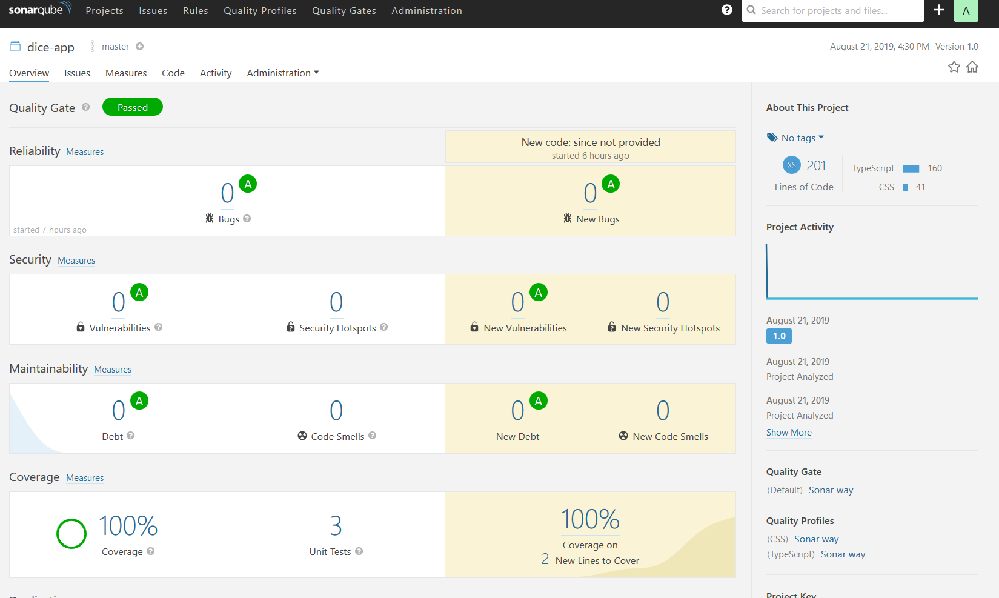

# Dice App
this is just a small example to get sonarqube running with tests and typescript, initialized with `create-react-app dice-app --typescript`

the key thing I missed for a while is the `sonar.typescript.lcov.reportPaths` option in the sonar-project.properties file. note the `typescript` in there, where normally it would be `javascript` :P

## running tests
I added a npm script `sonar` that runs tests and puts out a converage report and a special xml test report file from `jest-sonar-report`

## SonarQube

run the tests with `yarn sonar` or `npm run sonar` and then you can run sonarqube in a docker container to test it out

     docker run -d --name sonarqube -p 9000:9000 sonarqube

after you create a project it'll give you instructions for how to run a sonar report with `sonar-scanner` from the command line.

you'll just want to remove all the options except for `sonar.host.url` and `sonar.login` since we have a sonar-project.properties file

after all that you should get a nice report in sonarqube at http://locahost:9000 that looks like this:

